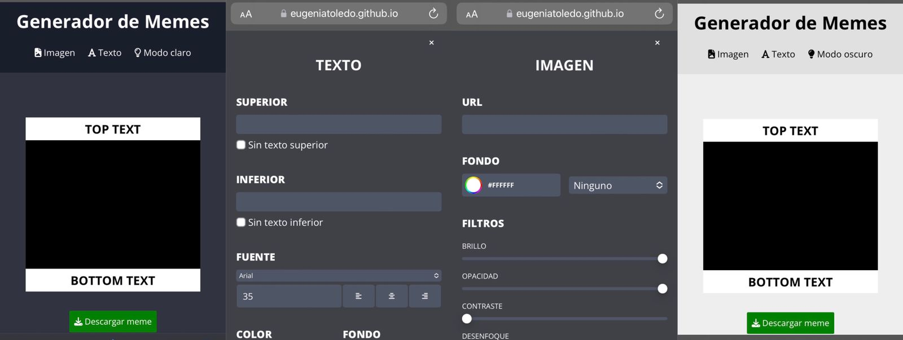
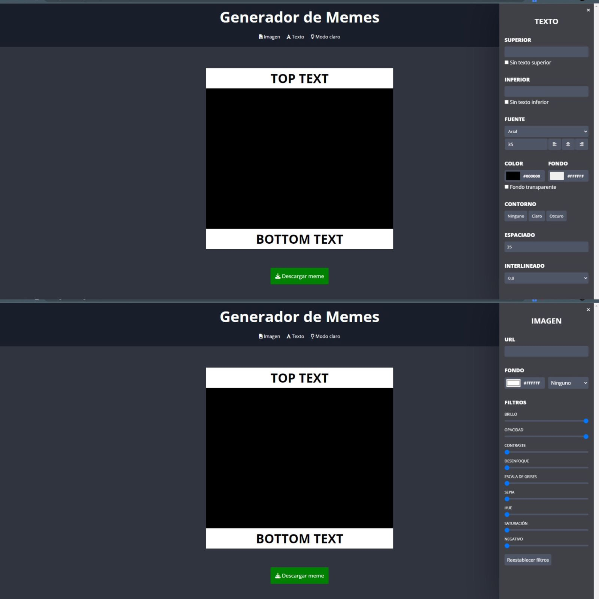
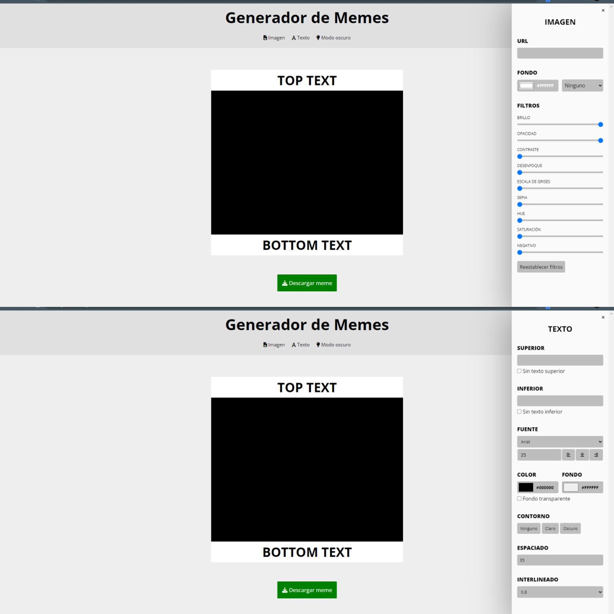
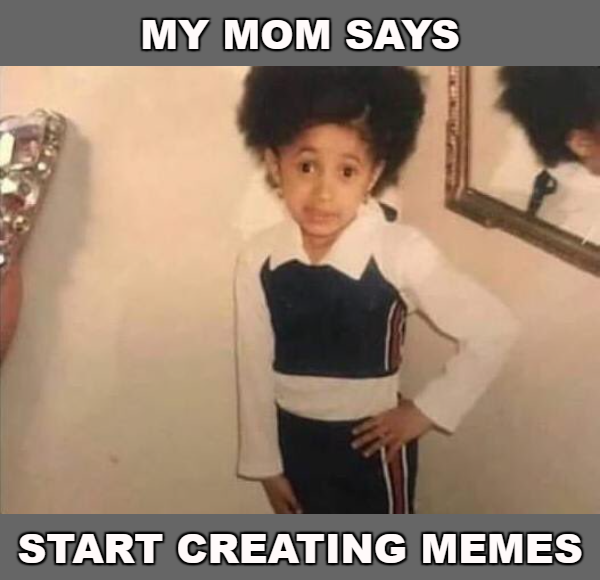

# Editor Memes by María Eugenia Toledo
---
### Java Script project 👩‍💻

> Hi everyone, I designed this meme editor for you can create your own meme 🤪 You have to paste the url image you like, put a text on it and edit as you want! Try it and design your meme ❗

---
#### Once you've played with the text and image styles 👉 you can download and save your meme

###### I show you how my site looks on different devices 👾

- Mobile 

- Desktop dark theme

- Desktop light theme

---

#### So... 

#### I share you the link of the program 🙋‍♀️ [Memes editor](https://eugeniatoledo.github.io/memes-editor/) ⚡ Thank you! Greetings